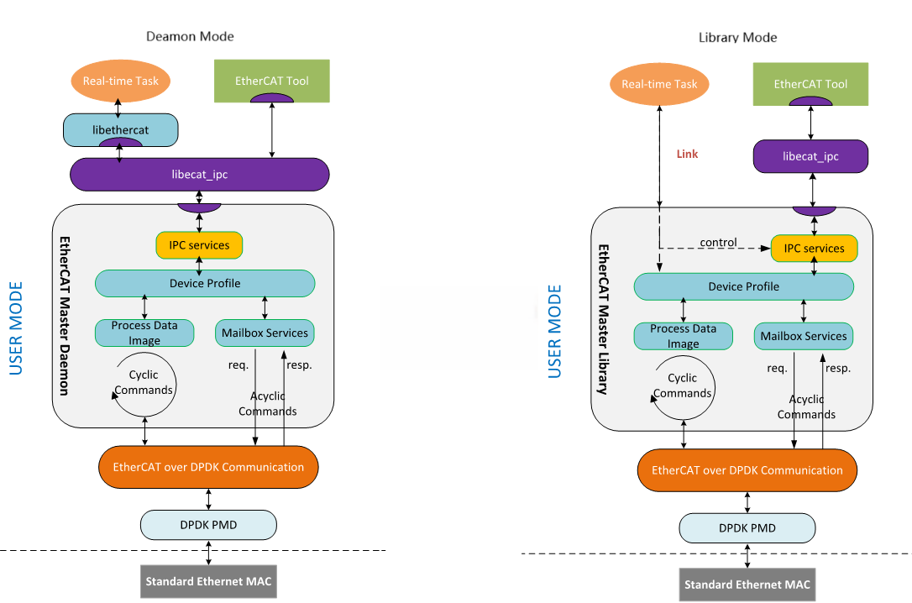

# Userspace EtherCAT Master Stack

## Introduction

The Userspace EtherCAT Master Stack optimizes IgH* EtherCAT Master Stack running in user space on Preempt-RT. It decouple to the OS kernel and eliminiates the system call overhead between the application and the EtherCAT kernel moudle. It also keeps all APIs from original IgH* EtherCAT Master Stack to seamlessly support EtherCAT application programs. Furthermore, it is easy to containerize EtherCAT stack for Virtual PLC applications(vPLC). 

The Userspace EtherCAT Master Stack migrates functions in ``master module`` from kernelspace to userspace, and leverage ``DPDK`` framework and ``vfio-pci`` driver to enable high-performance access capability for EtherCAT communication.  

## Architecture Overview

The architecture is as following:

<p>
    
</p>

Two mode options are supported as needed: 
* **Daemon Mode** builds EtherCAT master module as daemon application, which can run as standalone and provides one or more EtherCAT master instances, `Application Interface` and IPC service for multiple process communication. But it need at least 2x cores.
* **Library Mode** builds EtherCAT master module as library, which can be linked as dynamic library by the application. IPC service will only support on non-rt application(e.g. `ethercat` utility tool). It only need one core for one master instance.


## Getting Started

### Installing Dependencies (Oneshot Time)

Run the following packages to install dependence packages for building on Ubuntu:

```shell
    sudo apt-get install autoconf automake git libtool build-essential libmodbus5 libmodbus-dev 
```

To install the required DPDK packages on Ubuntu, run:

```shell
    sudo apt-get install dpdk dpdk-dev libdpdk-dev
```

### Installing Patches (Oneshot Time)

Run the script ``install_etherlab_patched.sh`` to apply optimization patches in ``ighethercat`` folder, the patch list is defined in ``patches/ighethercat.scc``.

```shell
    ./install_ethercatlab_patched.sh patches/ighethercat.scc
```

### Building EtherCAT Stack

Following with below commands to build EtherCAT Master Stack:

**For Daemon Mode**:

```shell
   cd ighethercat
   ./bootstrap
   ./configure --enable-sii-assign --disable-eoe --enable-hrtimer --disable-cycles --enable-usermode --enable-daemon
   make
```

**For Library Mode**:

```shell
   cd ighethercat
   ./bootstrap
   ./configure --enable-sii-assign --disable-eoe --enable-hrtimer --disable-cycles --enable-usermode --disable-daemon
   make
```

### Installing The Software

The below commands have to entered as root, which will install the EtherCAT header, scripts, libraries and userspace tool to the ``prefix`` path.

```shell
   make install
```

### Configuring EtherCAT Device

A mandatory ``ecrt.conf`` file installed in ``/etc/sysconfig/``. The ``ecrt.conf`` file contains the configuration variables needed to operate one or more masters. 
Do the following to configure it:
* **master_id**: It is the identification to match a group of configurations for a specific EtherCAT application.
* **master_mac**: It is used to specify the Ethernet MAC address of the EtherCAT port for the EtherCAT application.
* **debug_level**:  It is used to configure the debug level, and its valid value is 0-2.
* **drv_argv**: It supports to add extra eal parameters for dpdk framework, please refer to [EAL parameters](https://doc.dpdk.org/guides/linux_gsg/linux_eal_parameters.html)

### Binding VFIO driver

Before binding VFIO driver, Need to ensure kernel enabling following config options on ``vfio``.

```shell
# VFIO support
CONFIG_IOMMU_SUPPORT=y
CONFIG_INTEL_IOMMU=y
CONFIG_INTEL_IOMMU_SVM=y
CONFIG_INTEL_IOMMU_DEFAULT_ON=y
CONFIG_IRQ_REMAP=y
CONFIG_VFIO=m
CONFIG_VFIO_PCI=m
CONFIG_VFIO_PCI_VGA=y
CONFIG_VFIO_PCI_IGD=y
CONFIG_VFIO_MDEV=m
CONFIG_VFIO_MDEV_DEVICE=m
CONFIG_PCI_PASID=y
CONFIG_PCI_PRI=y

CONFIG_SWIOTLB=y

CONFIG_VIRTIO_PMD=y
```

The userspace ethercat master stack provides ``dpdk-driver-bind.sh`` script, which is installed in ``/usr/sbin`` by default to be used to bind ``vfio`` driver for the EtherCAT port. 
Following command to bind vfio driver:

```shell
   dpdk-driver-bind.sh start <PCIe BDF address>
```

Following command to unbind vfio driver:

```shell
   dpdk-driver-bind.sh stop <PCIe BDF address>
```

### Running application

**For Daemon Mode**:

Following with below command to start daemon with specific master instance:

```shell
   ./master/ethercatd -m <master instance index>
```

**For Library Mode**:

Just start your application, which need request specific master instance index as below code, ``libecat`` will select specify EtherCAT port for using:

```shell
    static ec_master_t *master = NULL;
    static int master_id = 0;

    master = ecrt_request_master(master_id);
    if (!master) {
        return -1;
    }

    ...

    if (ecrt_master_activate(master)) {
        return -1;
    }
```


```shell
   ./master/ethercatd -m <master instance index>
```

### Makefile Template for EtherCAT application
-------------------------------------------

Provided below are some Makefile templates for EtherCAT application. These templates are provided to build EtherCAT application without ``Makefile.am``.

**Makefile template for Preempt-RT kernel**

```shell
      CC     = gcc
      CFLAGS = -Wall -O3 -g -D_GNU_SOURCE -D_REENTRANT -fasynchronous-unwind-tables
      LIBS   = -lm -lrt -lpthread -lethercat -Wl,--no-as-needed -L/usr/lib
      
      TARGET = test
      SRCS   = $(wildcard *.c)
      
      OBJS   = $(SRCS:.c=.o)
      
      $(TARGET):$(OBJS)
              $(CC) -o $@ $^ $(LIBS)
      
      clean:
              rm -rf $(TARGET) $(OBJS)
      
      %.o:%.c
              $(CC) $(CFLAGS) -o $@ -c $<
```

**Makefile template for Xenomai/Dovetail kernel(No supporte)**

### License

The source code is licensed under the GPL v2. See [COPYING](COPYING) file for details.