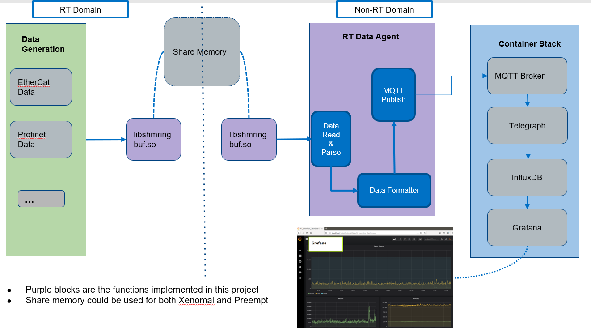

## RT Data Agent

The Real-time Data Agent provides a unified and real-time way to read and write data from and to a shared memory and a demo program to parse, pack, and send data to a container stack for storage and visualization.

It includes the following features:

* Block-based lockless shared memory ring buffer [`library`](./libshm)
* Python3 example program [`agent.py`](./agent.py)
* Example time series database [`container stack`](./stack)
* Example [`config.json`](./config.json) for data parse
* Real-time Data Agent supports both Xenomai kernel, Preempt RT kernel.




### Shared Memory Ring Buffer Library

This library implements unified and real-time APIs to read and write data from and to a shared memory without requiring a lock.

#### Design Principle
* Block based ring buffer, fixed maximum block size on initialization
* Block number set on initialization
* No lock required, one producer (write), one consumer (read) for one named ring buffer
* Buffer empty: write index == read index
* Buffer full: write index + 1 == read index
* Each read/write never across block boundary

Example:

The following figure shows an example with eight blocks ring buffer states.


#### API

* `shm_blkbuf_init` Use to initialize a named ring buffer with provided maximum block size and block number and return a handle.
    * `shm_handle_t shm_blkbuf_init(char *name, uint32_t blks, uint32_t blk_size)`
* `shm_blkbuf_open` Use to open a handle for writing.
    * `shm_handle_t shm_blkbuf_open(char *name)`
* `shm_blkbuf_close` Use to close a handle.
    * `int shm_blkbuf_close(shm_handle_t handle)`
* `shm_blkbuf_write` Use to write data to the ring buffer, only one writer is accepted for one opened ring buffer handle.
    * `uint32_t shm_blkbuf_write(shm_handle_t handle, void *buf, uint32_t len)`
* `shm_blkbuf_read` Use to read data from the ring buffer, only one reader is accepted for one opened ring buffer handle.
    `uint32_t shm_blkbuf_read(shm_handle_t handle, void *buf, uint32_t len)`
* `shm_blkbuf_empty` Returns `true` if the ring buffer is emtpy.
    * `int shm_blkbuf_empty(shm_handle_t handle)`
* `shm_blkbuf_full` Returns `false` if the ring buffer is full.
    * `int shm_blkbuf_full(shm_handle_t handle)`


### Simulation Test

#### Start the container stack first

* For public container stack (without mqtt broker)
```
$ cd stack
$ docker-compose up
```

* For public container stack (including mqtt broker)
```
$ cd stack
$ docker-compose -f docker-compose.yml -f mqtt-broker.yml up
```

#### Start the data simulation

1. Build the libshm
2. Run the `sim_rt_send`, it sends fake data to named share memory "shm_test"

#### Start the rt-data-agent example

1. Make sure the `libshmringbuf.so` path is correct in [`agent.py`](./agent.py)

   In default it is "/usr/local/lib/libshmringbuf.so".

   You can specify it with the arg "--lib", such as
    `sudo python3 agent.py --lib /usr/lib/libshmringbuf.so`
2. Make sure the python package `paho-mqtt` is installed
3. Run the demo
```
$ python3 agent.py
```

#### View the data in web browser

1. Open the URL `http://localhost:3000`
2. Choose dashboard `Servo_Monitor_Dashboard` you will see the pre-configured 
data for monitor

#### Run the stack in distruibuted node

1. Set the host IP where stack runs in the [`.env`](./stack/.env) file then start the stack
2. Start the agent by passing arg "--host", such as 
```
$ python3 agent.py --host $HOST_IP
```

