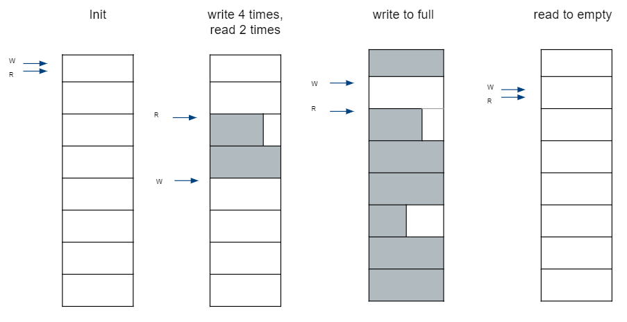

## Design principle
*  Block based ring buffer, fixed max block size when init
*  No lock, one producer (write), one consumer (read)
*  Empty: write index == read index
*  Full: write index + 1 == read index
*  each read/write never across block boundary



## How to build
```
$ mkdir build && cd build
```
For generic Linux,
```
$ cmake ..
```
To support Xenomai cobalt,
```
$ cmake .. -DWITH_COBALT=ON
```
```
$ make
```

## How to install
```
$ sudo make install
```
The library and header file will be put to the path /usr/local/.

## Examples
*  [Basic test](./test/shm_test.c)
*  [RT and Non-RT threads echo test](./test/rt2nonrt_test.c)